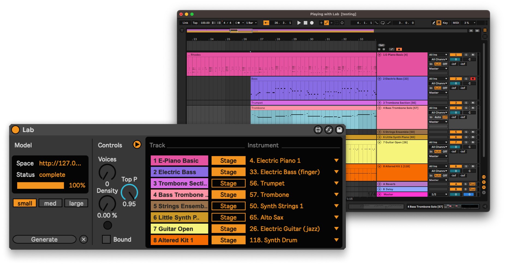

# Lab – use generative models for symbolic music inside of Ableton Live

Lab is a Max for Live device for using multi-track symbolic music infilling models within Ableton Live. 



## Overview

Lab gives generative models hosted with [Gradio](https://www.gradio.app) an interface for reading from and writing to the Ableton arrangement timeline. It is designed to communicate with a backend hosted on [HuggingFace Spaces](https://huggingface.co/spaces) or elsewhere. The project is organized as follows: `Lab.maxproj` manages files and dependencies required for the patch. `js/` holds all Javascript files used in js objects throughout the main patch. `node_content/` is the root directory of a TypeScript project for the Gradio interface. All patch dependencies here must be bundled and transpired to CJS for Node for Max. `patchers/` contains an exported Max for Live device `Lab.amxd`, and the Max patch `LabPatch.maxpat` that exports it.

## Installation

Tested on macOS with Node v21.1.0 and Max 8.

The client requires custom binaries for Node and npm since the versions packaged with Max are out of date. We haven't thoroughly tested whether or not the included binaries are compatible with other dependencies (namely, Gradio), so until C74 updates Max this is a required setup item. 

1. Install [Node](https://nodejs.org/en/download).
2. Copy this repo to wherever you keep your Max for Live devices. On macOS, this is usually `Music/Ableton/User Library/Max for Live Devices` or `Documents/Max 8/Max for Live Devices`. 
3. Start Lab by adding the device to a track within a Live set.
4. Open Lab in edit mode and modify the `node.script` object [to use custom binaries for Node and npm](https://docs.cycling74.com/max8/vignettes/09_n4m_custombinaries). You can do this by changing the object to the following:

  `[node.script gradio.js @node_bin_path /Users/YOUR_NAME/.nvm/versions/node/v21.1.0/bin/node @npm_bin_path /Users/YOUR_NAME/.nvm/versions/node/v21.1.0/bin/npm @autostart 1`]

## Usage

Lab is essentially a translation layer between MIDI data stored in the arrangement view of Ableton Live and the Gradio Javascript client. The device requires a running backend for remote inference. For an example of such a backend, see [this space](https://huggingface.co/spaces/caenopy/anticipation-backend) using the Anticipatory Music Transformer, a multi-track infilling model.

Once a backend is running, you can change the Gradio instance in Lab by providing the HuggingFace Space name or full URL of the hosted Gradio app to the `@args` attribute of `node.script`.

### Playing with Lab

1. Add device to any track in the arrangement.
2. Connect to a Gradio backend for remote inference.
3. Assign [General MIDI](https://en.wikipedia.org/wiki/General_MIDI#Program_change_events) instrument to all tracks by including a number in brackets next to the track name.
4. Create empty clips for all desired infilling regions and press Generate. 
5. Undo infill by using the normal shortcut command+Z and repeat  2. to create variations.

## Sharp Edges

- Bracketed numbers in the track name correspond to instrument given to the model. If no bracketed number is present, the instrument defaults to the index of the track.
- The demo Anticipatory Music Transformer assumes *each track has a unique instrument*.

## Running your own models

Lab retrieves MIDI data from Ableton and stores it in an object called an `ArrangementState`. An `ArrangementState` is essentially a list of Track dictionaries, where each Track dictionary contains metadata along with any clips currently written to that track.  

```
[
  {
    "id": "ID_OF_TRACK",
    "name": [
      "NAME_OF_TRACK"
    ],
    "instrument": 0,
    "clips": [
      {
        "id": ID_OF_CLIP,
        "name": [
          "NAME_OF_CLIP"
        ],
        "start_time": 0,
        "end_time": 0,
        "notes": [
          {
            "note_id": 0,
            "pitch": 0,
            "start_time": 0,
            "duration": 0,
            "velocity": 0,
            "mute": 0,
            "probability": 0,
            "velocity_deviation": 0,
            "release_velocity": 0
          }
        ]
      }
    ]
  }
]
```

To run your own models, you will need to write a Gradio app that takes as input an `ArrangementState` as well as any optional inference parameters, and as output returns an `ArrangementState`. 

## Requested features 

- [ ] Bounded conditional generation from the loop marker, i.e. extract and write notes only within loop region.
- [ ] Better configuration GUI for Node and rpm binaries.
- [ ] Better logging.
- [ ] Density knob and density button which calculates the note density of all notes in selected region and automatically sets the knob.
- [ ] Once the Gradio client is stable, modify the generation process to stream data back to the interface and progressively write generated notes to the arrangement.

## License

Licensed under the Apache License, Version 2.0 (the "License"); you may not use this file except in compliance with the License. You may obtain a copy of the License at

http://www.apache.org/licenses/LICENSE-2.0

Unless required by applicable law or agreed to in writing, software distributed under the License is distributed on an "AS IS" BASIS, WITHOUT WARRANTIES OR CONDITIONS OF ANY KIND, either express or implied. See the License for the specific language governing permissions and limitations under the License.